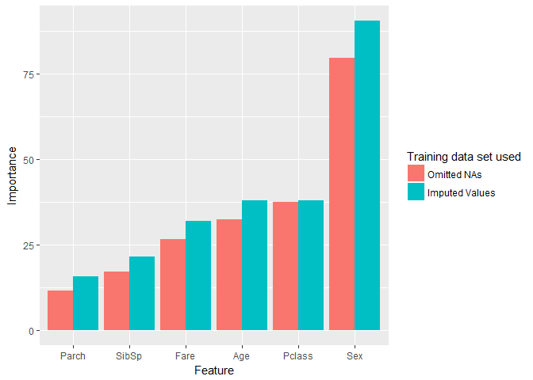

titanic
================
Bonnie
January 25, 2017

My first kaggle competition: Titanic
------------------------------------

We chose this competition (<https://www.kaggle.com/c/titanic>) because it is supposed to be a great introduction to kaggle and to machine learning. I have to say that I was ~90% out of my comfort zone. It was really helpful to see other people's code to see how to even start approaching the problem. A lot of people did very complicated things but given my limited time and I'm trying to finish my PhD, I figured I should work on a simple question. As a complete newbie, my question is: does the missing data affect the output of the random forest method? Is imputing values or omitting data better to deal with this?

I think there are many camps to how to approach data- how clean is "clean"" and to what is "too clean"? As a grad student, I have learned that real-world data is never clean. Data needs to be clean enough to see the signal and make conclusion, but also too much cleaning can lead to loss of other information that could be critical.

To approach this question, first I generated 2 different training sets: 1) omitted rows containing NA (train\_set\_omit) 2) imputing missing values (train\_set\_impute)

Then I would run the random forest method on both datasets seperately to generate a forest of models. Finally, I would use the forests to run a prediction of who died and who survived on the test set provided. Lastly, I will see how different they are in their predictions.

So here it is:

``` r
# Explore the training data set
str(train)
```

    ## 'data.frame':    891 obs. of  12 variables:
    ##  $ PassengerId: int  1 2 3 4 5 6 7 8 9 10 ...
    ##  $ Survived   : int  0 1 1 1 0 0 0 0 1 1 ...
    ##  $ Pclass     : int  3 1 3 1 3 3 1 3 3 2 ...
    ##  $ Name       : Factor w/ 891 levels "Abbing, Mr. Anthony",..: 109 191 358 277 16 559 520 629 417 581 ...
    ##  $ Sex        : Factor w/ 2 levels "female","male": 2 1 1 1 2 2 2 2 1 1 ...
    ##  $ Age        : num  22 38 26 35 35 NA 54 2 27 14 ...
    ##  $ SibSp      : int  1 1 0 1 0 0 0 3 0 1 ...
    ##  $ Parch      : int  0 0 0 0 0 0 0 1 2 0 ...
    ##  $ Ticket     : Factor w/ 681 levels "110152","110413",..: 524 597 670 50 473 276 86 396 345 133 ...
    ##  $ Fare       : num  7.25 71.28 7.92 53.1 8.05 ...
    ##  $ Cabin      : Factor w/ 148 levels "","A10","A14",..: 1 83 1 57 1 1 131 1 1 1 ...
    ##  $ Embarked   : Factor w/ 4 levels "","C","Q","S": 4 2 4 4 4 3 4 4 4 2 ...

``` r
# Choose a more narrow set 
# I eliminiated categories that I thought werent meaningful (e.g. Cabin) and doesn't require further processing to try to look for meaning (e.g. names)
train_set <- train[, c(2, 3, 5, 6, 7, 8, 10)]

## Creating the data set that omits rows with NA
# Remove rows with NA
train_set_omit <- na.omit(train_set)
forest_of_random_omission <- randomForest(as.factor(Survived) ~ ., data = train_set_omit, ntree = 500, importance = TRUE)

# Creating the data set that imputes rows with NA
# 177 values of 891 values are missing for age. That is a little less than 20%. 
train_set_impute <- mice (train_set, method = "pmm", seed = 80)
```

    ## 
    ##  iter imp variable
    ##   1   1  Age
    ##   1   2  Age
    ##   1   3  Age
    ##   1   4  Age
    ##   1   5  Age
    ##   2   1  Age
    ##   2   2  Age
    ##   2   3  Age
    ##   2   4  Age
    ##   2   5  Age
    ##   3   1  Age
    ##   3   2  Age
    ##   3   3  Age
    ##   3   4  Age
    ##   3   5  Age
    ##   4   1  Age
    ##   4   2  Age
    ##   4   3  Age
    ##   4   4  Age
    ##   4   5  Age
    ##   5   1  Age
    ##   5   2  Age
    ##   5   3  Age
    ##   5   4  Age
    ##   5   5  Age

``` r
train_set_imputed <- complete(train_set_impute, 1)
forest_of_random_imputed <- randomForest(as.factor(Survived) ~ ., data = train_set_imputed, ntree = 500, importance = TRUE)


# imputing vs omitting data on feature importance
imp_omit <- importance(forest_of_random_omission, type = 1)
imp_omit_feat <- data.frame(Feature = row.names(imp_omit), Importance = imp_omit[,1])
imp_impute <- importance(forest_of_random_imputed, type = 1)
imp_impute_feat <- data.frame(Feature = row.names(imp_impute), Importance = imp_impute[,1])
colnames(imp_omit_feat) <- c("Feature", "Importance_omit")
colnames(imp_impute_feat) <- c("Feature", "Importance_impute")
combo <- merge(imp_omit_feat, imp_impute_feat, by = "Feature")
combo_melt <- melt(combo, id.vars = "Feature", variable.name = "grp", value.name = "Importance")
combo_melt$grp <- as.factor(combo_melt$grp)

omission_plot <- ggplot(combo_melt, aes (x = reorder(Feature, Importance), y = Importance, group = grp)) + geom_bar(stat = "identity", aes(fill = grp), position = "dodge")
omission_plot <- omission_plot + scale_fill_discrete(name = "Training data set used", labels = c("Omitted NAs", "Imputed Values")) + xlab("Feature")
omission_plot
```

 It seems that the order of importance of the variables doesn't change. However the importance of Pclass is larger by only 0.14. Although it didn't change the order but it does change the magnitudes and their relative differences. Maybe the order wasn't different in this data set but it is something to keep in mind when imputing values into future data sets. Imputing values does change the outcome of the forest, which in turn has an effect on the prediction.

Next I will crudely look at whether or not it has a significant effect on the resulting prediction.

``` r
prediction_omission <- predict(forest_of_random_omission, test)
prediction_impute <- predict(forest_of_random_imputed, test)

solution_omission <- data.frame(PassengerID = test$PassengerId, Survived = prediction_omission)
solution_impute <- data.frame(PassengerID = test$PassengerId, Survived = prediction_impute)

summary(solution_omission$Survived)
```

    ##    0    1 NA's 
    ##  214  117   87

``` r
summary(solution_impute$Survived)
```

    ##    0    1 NA's 
    ##  210  121   87

They differ by only 4 people out of 418 trials, but really 331 successful predictions. That's just 1.2% of the total population that's different.

It's difficult to say which method is better, since I do not have the answers to the test set. The 2 methods only differed slightly in the resulting predictions. In this context, perhaps that amount of error is tolerable.

After this short exercise, I'm glad I ran my first machine learning algorhithm. I understand basic concepts behind them but never actually did it, so this was a great ice breaker (unintentional titanic pun). Through this kaggle competition, I learned what the random forest algorhithm is, and what considerations are needed that could affect the outcome of the forest. The bigger picture lesson that I learned is beware of how you clean data.
